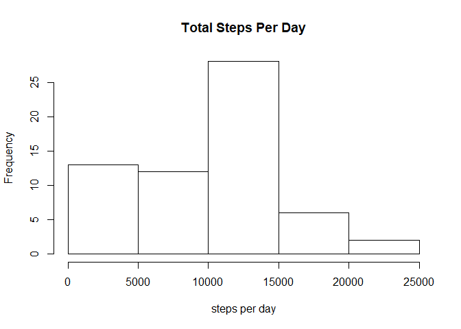
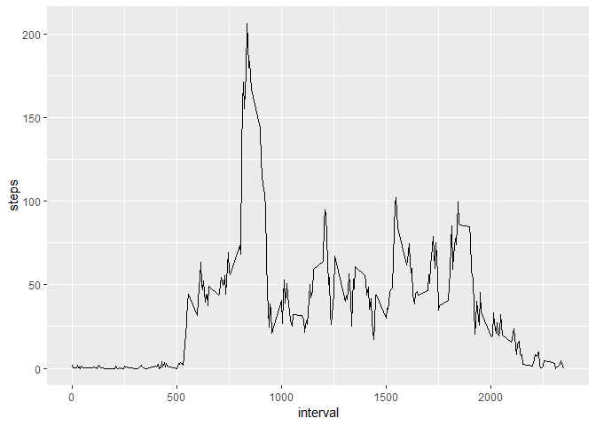
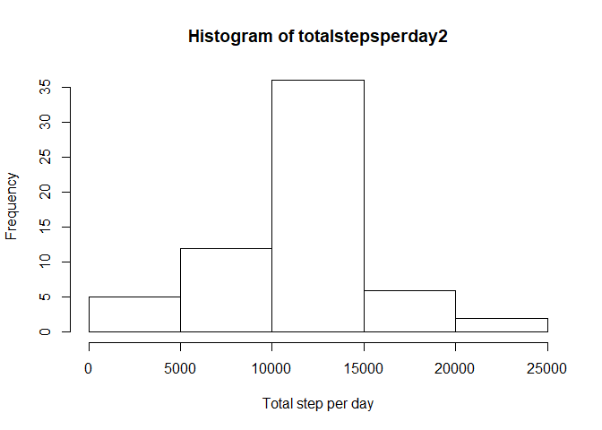
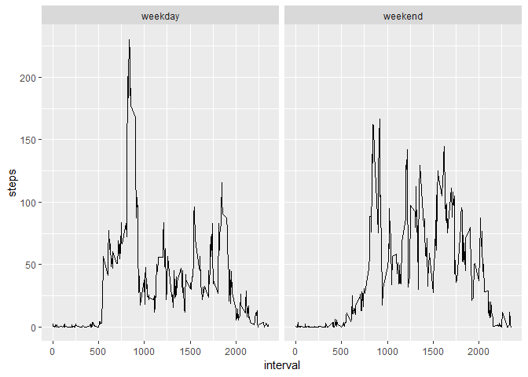

# Reproducible Researche: Project 1


## Loading and preprocessing the data

```r
data1 <- read.csv("activity.csv", header = TRUE)
```


## What is mean total number of steps taken per day?
In this part off the assignement I have ignored missing values 

### Calculate the total number of steps taken per day
I am using the function  tapply

```r
totalstepsperday <- tapply(data1$steps,data1$date, sum, na.rm = TRUE)
```

### Histogram off the total number off steps taken every day

```r
hist(totalstepsperday, main = "Total Steps Per Day", xlab = "steps per day")
```

<!-- -->

### Mean and  Median of total steps per day
Mean

```r
mean(totalstepsperday)
```

```
## [1] 9354.23
```

Median

```r
median(totalstepsperday)
```

```
## [1] 10395
```

## What is the average daily activity pattern?

### calculating the average daily activity pattern

```r
averagestepsperday <- aggregate(steps ~ interval, data = data1, mean, na.rm = TRUE)
```

### create the plot

```r
library(ggplot2)
g <- ggplot(averagestepsperday, aes(x= interval, y=steps))
g + geom_line()
```

<!-- -->

### The 5 minut interval with the maximum amount off steps

```r
averagestepsperday[which.max(averagestepsperday$steps),]
```

```
##     interval    steps
## 104      835 206.1698
```


## Imputing missing values
### Calculate and report the total number of missing values in the dataset

```r
sum(is.na(data1$steps))
```

```
## [1] 2304
```

### Devise a strategy for filling in all of the missing values in the dataset. The strategy does not need to be sophisticated.
I using interval data  
first I copy the dataset, to keep the future dataset with no NA apart from the dataset with NA

```r
data2 <- data1
```
Then i am using the fuction to fill the NA values with the mean of interval 

```r
functiaply <- function(steps,interval){
  filled <- NA 
  if (!is.na(steps)) 
    filled <- c(steps) else filled <- (averagestepsperday[averagestepsperday$interval == interval, "steps"])
    return(filled)
}
data2$steps <- mapply(functiaply,data2$steps,data2$interval)  
```

### calculating the average daily activity pattern 

```r
totalstepsperday2 <- tapply(data2$steps,data2$date, sum)
```

### creating the Histogram without NA

```r
hist(totalstepsperday2, xlab = "Total step per day")
```

<!-- -->

### Mean and  Median of total steps per day without NA
Mean without NA

```r
mean(totalstepsperday2)
```

```
## [1] 10766.19
```
Median without NA

```r
median(totalstepsperday2)
```

```
## [1] 10766.19
```

#### Conclusion
While the histogram of the data with and without the NA remanse the same the mean changes 


## Are there differences in activity patterns between weekdays and weekends?

###Create a new factor variable in the dataset with two levels - "weekday" and "weekend" indicating whether a given date is a weekday or weekend day.
Be aware that you should write the function days sunday and saturday according to the language of your country 

```r
data2$date <- as.Date(data2$date)
data2$weekday <- weekdays(data2$date)
data2$daytype <- ifelse(data2$weekday == "søndag" | data2$weekday == "lørdag", "weekend", "weekday")
```

###calculate with different weekedays

```r
averagestepsperday <- aggregate( steps ~ interval + daytype, data = data2, mean)
```

### creating the graph
I am creating two plots wth ggplot one for weekdays and one for weekend

```r
g <- ggplot(averagestepsperday, aes( interval, steps))
 g + facet_grid(. ~ daytype) + geom_line()
```

<!-- -->


#### Conclusion
The graph indicate that the test subject walking is more concentrated on weekdays then doing the weekend.
